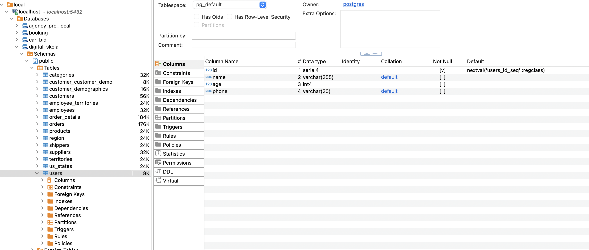
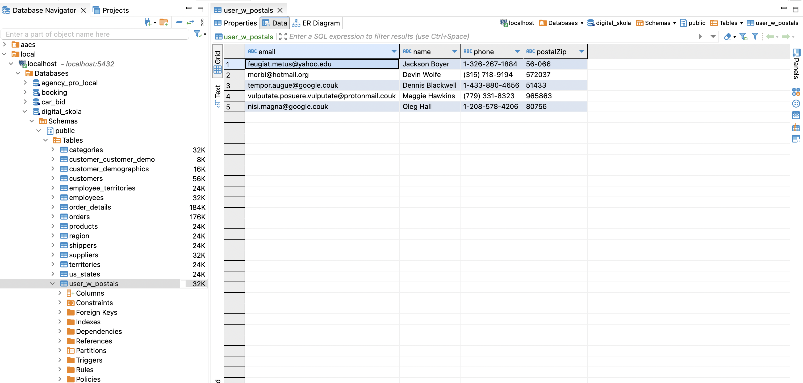
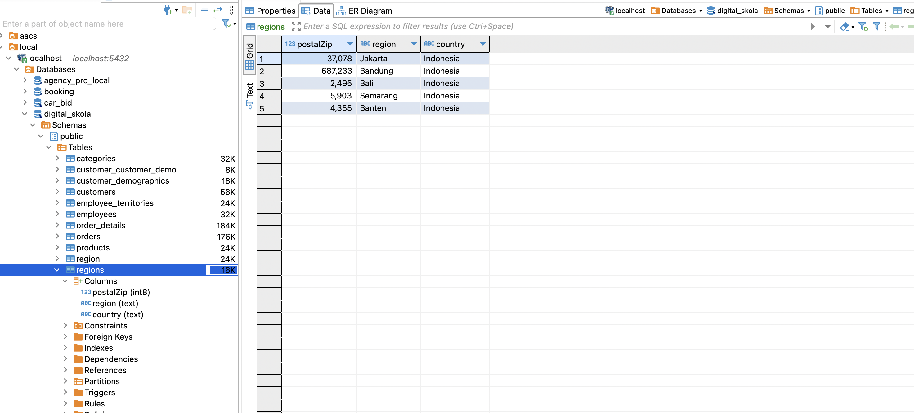
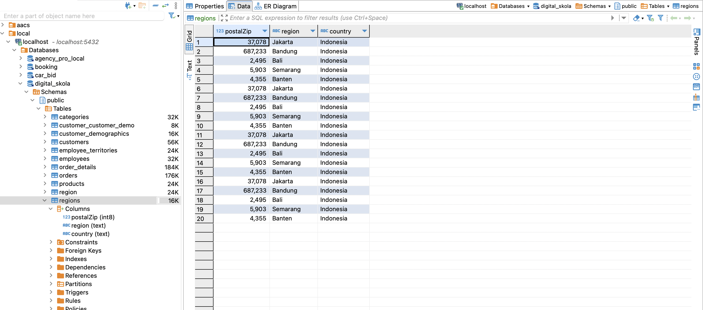

# digitalskola-batch-processing

## Setup

1. copy .env.example and create new file .env
2. running one by one file on folder src
3. there are 4 process extract csv to table
    - Create Table
    - Create Table & Insert Data directly from file
    - Insert Data with cursor
    - Insert Data with directly copy row by row csv

_Picture 1: Create Table Users_

_Picture 2: Insert From File user postals_

_Picture 3: Insert Data regions_

_Picture 4: Insert Data copy regions_